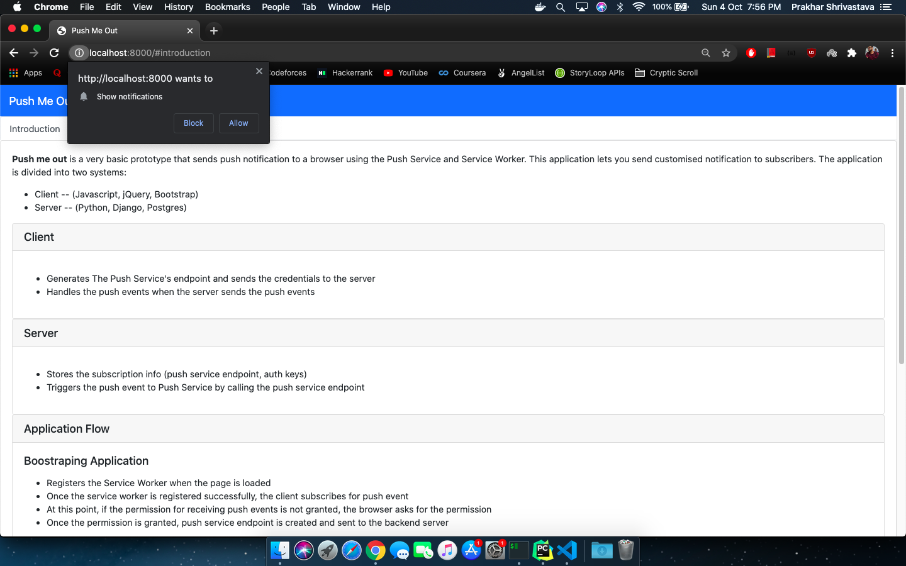
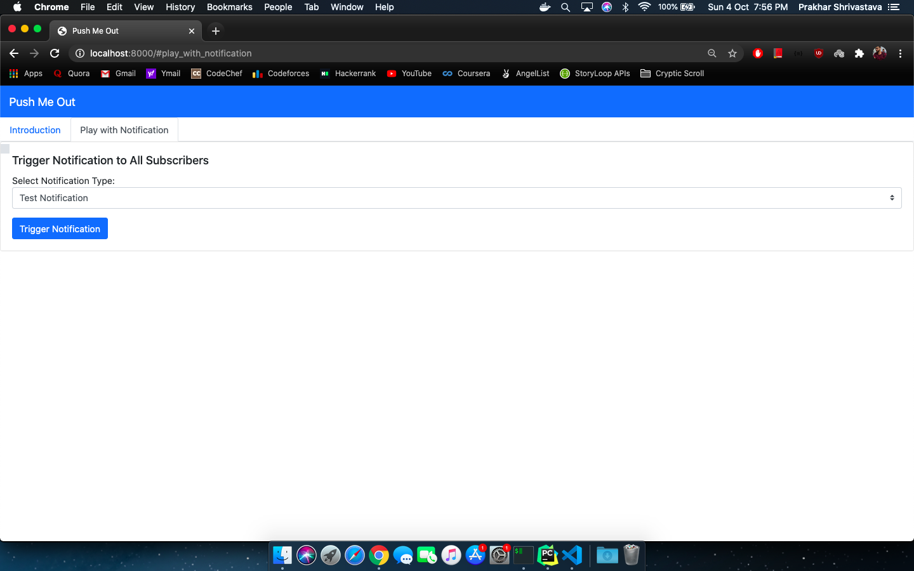
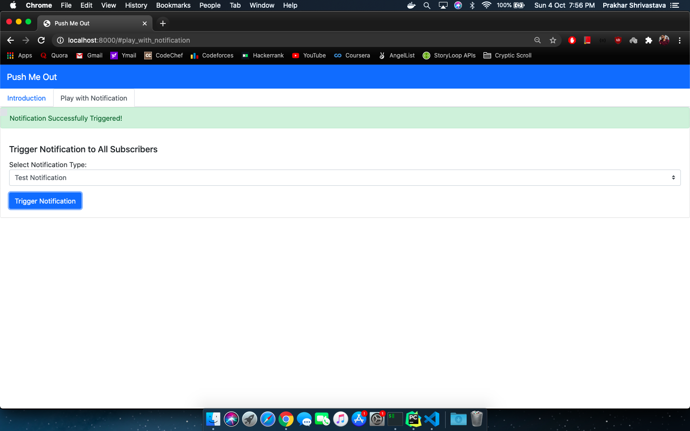
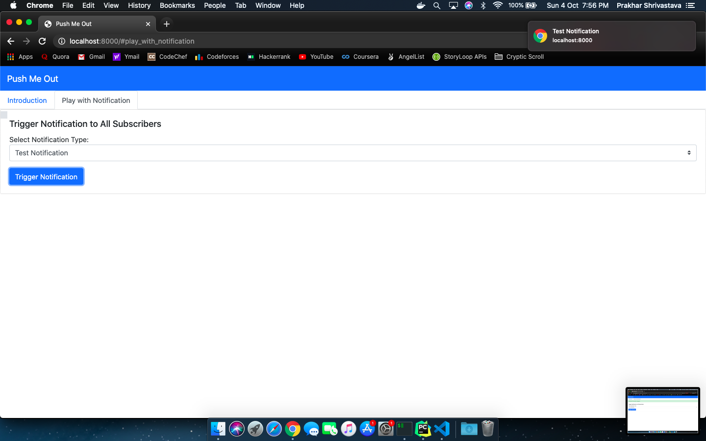
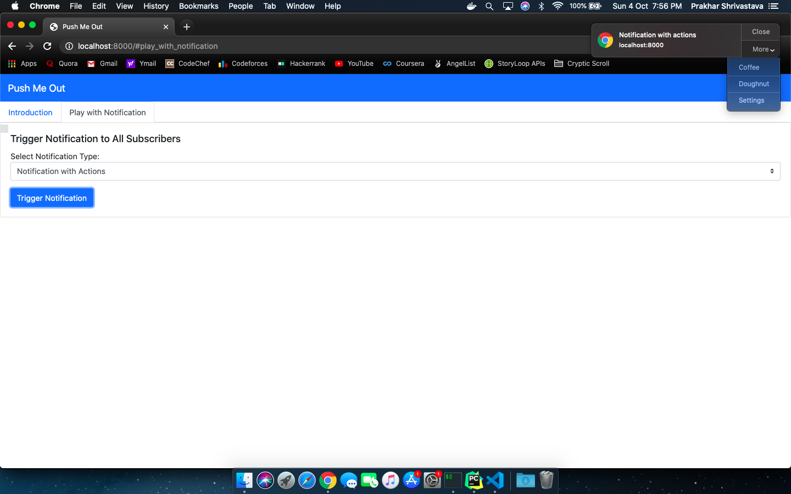
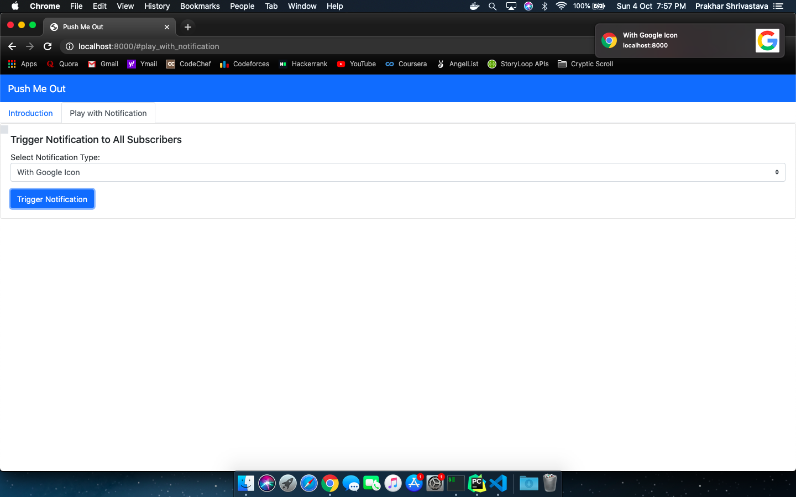

# Push me Out Client
JS Client for Push me out

# Steps to setup the client

### Start http-server
* run `npm install http-server -g`
* run `http-server --p 8000`

### Generate VAPID Keys
* run `npm install -g web-push`
* run `web-push generate-vapid-keys`
* create a new file `secrets.js` in `scripts/`
* Add the following contents to the file
```
APPLICATION_KEY = {generated_public_key}
```
* Save the **Private Key** for application server

Open `localhost:8000` on your browser and start sending notification to yourself.

# Demo

### Requesting Permission
* When the page is loaded, the application asks for permission for sending push events
* 

### Play with Notification
* The tab `Play With Notification` lets you send customised notifications (Notification Customisation happens on backend server)
* 

### Trigger Notification
* Currently, notification is pushed to all the active subscribers
* Trigger Success Alert is shown once the notification is triggered
* 

### Notification Types
* Notification Types are supported from backend (Notification types are fetched on the page load)
* **Basic Notification**
* 
* **Notification With Actions**
* 
* **Notification With Image**
* 

***